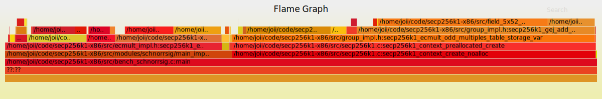

# secp256k1 schnorrsig 算法在 ckb-vm 运行

## 编译
1. 依赖： [ckb-riscv-gnu-toolchain
](https://github.com/nervosnetwork/ckb-riscv-gnu-toolchain)
2. 执行根目录 build_riscv.sh 脚本
3. bench_schnorrsig 即为执行程序

## 性能分析
使用 [ckb-vm-pprof](https://github.com/nervosnetwork/ckb-vm-pprof) 生成火焰图进行分析：

### 汇编代码优化
该库原本支持x86和arm的汇编优化，但是移植到risc-v后还没有做，从火焰图中可以看出 secp256k1_fe_mul_inner 和 secp256k1_fe_sqr_inner 占用了绝大多数的执行时间。
